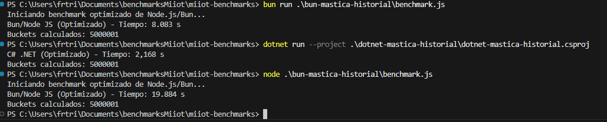

# Benchmark de Rendimiento: .NET vs. Bun vs. Node.js by Francisco Trillo 🔥

En este documento presento los resultados de un benchmark que diseñé para medir el rendimiento de **.NET (C#), Bun y Node.js** en una tarea de procesamiento de datos intensiva y puramente computacional (CPU-bound).

## El Desafío: "Mastica-Historial"

El algoritmo que probé simula una tarea común de procesamiento de logs o series temporales:
1.  Genera una cantidad masiva de registros de datos (50, 150 y 200 millones), cada uno con una marca de tiempo y un valor numérico.
2.  Agrupa estos registros en "buckets" de 10 minutos. En mi prueba, esto genera 1 bucket por cada 10 registros, es decir, 5M, 15M y 20M de buckets respectivamente.
3.  Calcula la suma y el conteo de valores para cada bucket.
4.  Finalmente, calcula el promedio de cada bucket.

Esta prueba está diseñada para estresar el **rendimiento del bucle principal, las operaciones matemáticas y el acceso a una estructura de datos de tipo diccionario/mapa (tabla hash)**. No involucra operaciones de I/O (disco o red).

## Metodología y Garantía de Justicia

Para asegurar una comparación justa y precisa, seguí los siguientes principios:

*   **Algoritmo Idéntico:** La lógica de programación es una réplica fiel en C# y JavaScript.
*   **Ejecución en un Solo Hilo:** Todas las pruebas se ejecutaron utilizando **un único hilo de procesamiento (single-thread)** para una comparación equitativa del rendimiento por núcleo.
*   **Compilación Optimizada:** La prueba principal de .NET se ejecutó en modo **Release**.

### Entorno de Pruebas
Todas las mediciones se realizaron en el siguiente hardware para garantizar la consistencia:
*   **CPU:** AMD Ryzen 7 5800X (8 núcleos, 16 hilos)
*   **RAM:** 16 GB DDR4 3600 MHz
*   **Sistema Operativo:** Windows

## Cómo Ejecutar el Benchmark
Para replicar estos resultados, puedes usar los siguientes comandos desde la raíz del proyecto. Asegúrate de tener instalados .NET, Node.js y Bun.

### .NET (Modo Release - Optimizado)
```powershell
dotnet run -c Release --project ./dotnet-mastica-historial/dotnet-mastica-historial.csproj
```
### Bun
```powershell
bun run ./bun-mastica-historial/aot-processing.js
```
### Node.js
```powershell
node ./bun-mastica-historial/aot-processing.js
```

---

## Versiones de los Runtimes

Las pruebas se realizaron con las siguientes versiones:

- **Bun:** 1.2.15
- **Node.js:** v22.14.0
- **.NET SDK:** 9.0.301

## Resultados con 50 Millones de Registros (5M Buckets)

| Runtime | Tiempo (segundos) | Observaciones |
| :--- | :--- | :--- |
| **.NET (Release)** | **~1,449 s** | 🥇 El ganador por un margen mínimo. |
| **Bun** | **~1,473 s** | 🥈 Empate técnico con .NET. |
| **Node.js** | **~4,324 s** | 🐢 Más de 3 veces más lento. |

---

## Pruebas de Escalabilidad: 150 y 200 Millones de Registros

Para entender cómo se comportan los runtimes bajo una carga de trabajo mayor, llevé la prueba a 150 millones de registros (15M de buckets) y 200 millones de registros (20M de buckets). Los resultados son reveladores.

| Runtime | Tiempo (150M de registros) | Tiempo (200M de registros) |
| :--- | :--- | :--- |
| **.NET (Release)** | **~4,56 s** | **~5,99 s** |
| **Bun** | **~5,06 s** | **~6,42 s** |
| **Node.js** | **~12,23 s** | **Falla con `RangeError`** 💥 |


*Gráfico comparando los tiempos de ejecución para 50M de registros. .NET y Bun muestran un rendimiento casi idéntico. Menor es mejor.*

### Análisis de Escalabilidad y la Falla de Node.js
El resultado más importante de este benchmark se observa al escalar.

*   **Rendimiento Lineal de .NET y Bun:** Tanto .NET como Bun escalan de manera predecible y robusta. Mantienen su rendimiento de élite incluso con cargas de trabajo masivas, demostrando la eficiencia de sus motores y la solidez de sus estructuras de datos.

*   **El Límite del `Map` de V8:** El resultado de Node.js es crucial.
    *   Con **150 millones de registros (15M de buckets)**, Node.js completa la tarea, aunque siendo 2.5 veces más lento que sus competidores.
    *   Sin embargo, al pasar a **200 millones de registros (20M de buckets)**, el programa falla abruptamente con `RangeError: Map maximum size exceeded`.
    *   **La causa es una limitación arquitectónica del motor V8**: su objeto `Map` tiene un límite estricto de **16,777,216** (2^24) entradas. Mi prueba de 200M de registros, al generar 20M de buckets, supera directamente este umbral.

En contraste, ni el `Dictionary<TKey, TValue>` de .NET ni el `Map` de Bun (respaldado por JavaScriptCore y Zig) tienen esta limitación artificial. Su capacidad está limitada únicamente por la memoria RAM disponible en el sistema.

---

## Conclusiones de mi Benchmark

1.  **.NET y Bun son competidores de élite en rendimiento y escala:** Para el tipo de cómputo intensivo que probé, tanto .NET como Bun ofrecen un rendimiento de vanguardia. Son capaces de manejar datasets con una cardinalidad de claves extremadamente alta sin problemas.

2.  **.NET es un pilar de rendimiento y robustez:** En mis pruebas, .NET se corona como el más rápido y el más robusto. Su combinación de un compilador de clase mundial (RyuJIT) y estructuras de datos sin límites artificiales lo convierte en mi opción preferida para el procesamiento de datos a gran escala.

3.  **Elige la herramienta adecuada para el trabajo y sus limitaciones:**
    *   Para **servidores API y tareas asíncronas (I/O)**, **Node.js** sigue siendo una opción excelente y la más popular.
    *   Para **algoritmos de procesamiento de datos y tareas CPU-intensivas**, mis resultados muestran que **.NET** o **Bun** ofrecen un rendimiento y una robustez muy superiores.
    *   **¡Cuidado con la cardinalidad en Node.js!** Si tu caso de uso puede generar más de 16.7 millones de claves únicas en un mapa o diccionario, **Node.js no es una opción viable** debido a la limitación de su motor V8.

4.  **¡Compila en modo Release!** La diferencia entre .NET Debug y Release es enorme. En mi prueba de 50M, el código optimizado fue un **55% más rápido**. Nunca se debe medir el rendimiento en una compilación de desarrollo.

### Un Benchmark para un Caso de Uso Específico
Es crucial recordar que diseñé "Mastica-Historial" para mi caso de uso específico: el procesamiento intensivo de datos históricos de dispositivos para tareas de IA.

Para evaluaciones de rendimiento en otros escenarios, como servidores web o acceso a bases de datos, recomiendo consultar benchmarks especializados.

*   **[TechEmpower Web Framework Benchmarks](https://www.techempower.com/benchmarks/#section=data-r23y):** El estándar de la industria para comparar frameworks web.
*   **[SharkBench](https://sharkbench.dev/):** Otro gran recurso que compara el rendimiento de diferentes runtimes de JavaScript.